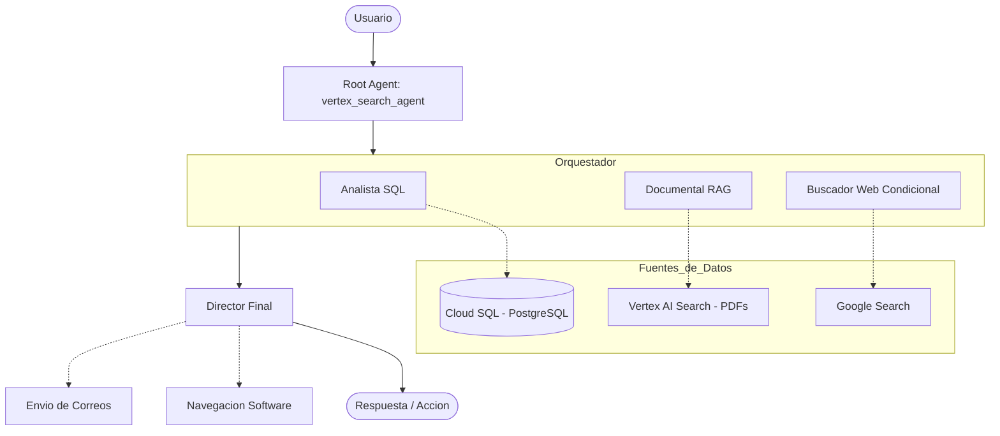

# MultiAgentSystem_Absidoc 🚀

Sistema MultiAgente inteligente diseñado para la gestión y consulta de recursos humanos en Absidoc. Este sistema utiliza inteligencia artificial avanzada para interactuar con bases de datos estructuradas, documentos no estructurados (PDFs) y realizar búsquedas en la web, todo orquestado para proporcionar respuestas precisas y acciones ejecutivas.

## 🏗️ Arquitectura del Sistema

El sistema utiliza **Google ADK** (Agent Development Kit) para orquestar múltiples agentes especializados en un flujo secuencial y paralelo.



### Agentes Especializados
- **Analista SQL**: Experto en consultas estructuradas a la base de datos PostgreSQL (RRHH). Maneja expedientes, cumpleaños, contratos y cálculos de vacaciones.
- **Documental RAG**: Especialista en búsqueda semántica sobre documentos y PDFs utilizando Vertex AI Search.
- **Buscador Web**: Se activa solo cuando se requiere información externa actualizada de internet.
- **Director Final**: Sintetiza la información de todos los agentes, realiza cálculos finales y ejecuta acciones como navegación en el software o envío de correos electrónicos.

---

## 🛠️ Tecnologías

- **Lenguaje**: Python 3.11+
- **Framework de Agentes**: [Google ADK](https://pypi.org/project/google-adk/)
- **Modelos de Lenguaje**: Gemini 2.5 Flash
- **Búsqueda Semántica**: Google Cloud Vertex AI Search
- **Base de Datos**: PostgreSQL (Google Cloud SQL) con SQLAlchemy
- **API**: FastAPI / Uvicorn
- **Contenerización**: Docker

---

## ⚙️ Configuración del Entorno

El sistema requiere las siguientes variables de entorno (configuradas en un archivo `.env` o en el entorno de despliegue):

| Variable | Descripción |
| --- | --- |
| `GOOGLE_CLOUD_PROJECT` | ID del proyecto en Google Cloud |
| `GOOGLE_CLOUD_LOCATION` | Región (ej. `us-central1`) |
| `GOOGLE_ENGINE_ID` | ID del Data Store en Vertex AI Search |
| `direccion` | Conexión a Cloud SQL (Instance Connection Name) |
| `userbd` | Usuario de la base de datos |
| `passwordbd` | Contraseña de la base de datos |
| `bd` | Nombre de la base de datos |
| `GESTOR_API_BASE_URL` | URL base para la API de gestión de correos |

---

## 🚀 Cómo Correr el Proyecto

### Localmente
1. Instalar dependencias:
   ```bash
   pip install -r requirements.txt
   ```
2. Ejecutar con ADK:
   ```bash
   adk web
   ```
   *Esto iniciará la interfaz de desarrollo y la API en el puerto predeterminado (8000).*

### Con Docker
1. Construir la imagen:
   ```bash
   docker build -t multiagent-absidoc .
   ```
2. Correr el contenedor:
   ```bash
   docker run -p 8080:8080 --env-file .env multiagent-absidoc
   ```

---

## 📧 Acciones de Correo
El sistema implementa un flujo de seguridad de **2 pasos** para el envío de correos:
1. El Agente Director presenta un borrador profesional al usuario.
2. El correo SOLO se envía tras la confirmación explícita ("sí", "enviar", "ok") del usuario.
